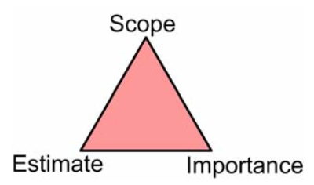
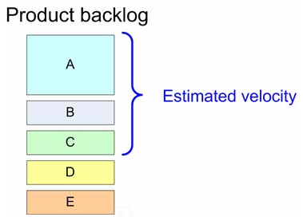
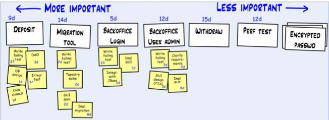
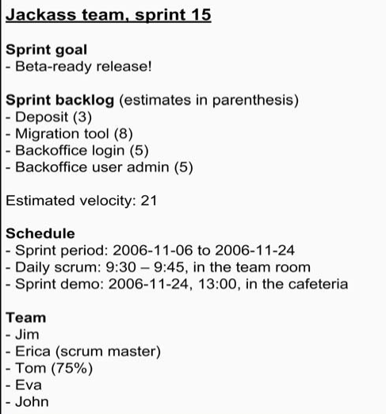

# 1 Sprint Plan meeting准备

在 Sprint Plan meeting之前，要确保产品 backlog 的井然有序：

- 产品 backlog 必须存在。并且项目团队已经进行了初步的effort估算。
- 只能有一个产品 backlog 和一个产品负责人（对于一个产品而言，Nokia内部叫APO，Area Product Owner）。
- 所有重要的 backlog 条目都已经根据重要性被评过分，不同的重要程度对应不同的分数。这需要APO根据项目计划进行衡量。
   - 其实，重要程度比较低的 backlog 条目，评分相同也没关系，因为它们在这次Sprint Plan meeting上可能根本不会被提出来。
   - 无论任何故事，只要APO相信它会在下一个sprint 实现，那它就应该被划分到一个特有的重要性层次。
   - 分数只是用来根据重要性对 backlog 条目排序。假如 A 的分数是 20，而 B 的分数是 100，那仅仅是说明 B 比 A 重要而已，绝不意味着 B 比 A 重要五倍。如果 B 的分数是 21 而不是 100，含义也是一样的！
   - 最好在分数之间留出适当间隔，以防后面出现一个C，比 A 重要而不如 B 重要。当然我们也可以给 C打一个 20.5 分，但这样看上去就很难看了，所以我们还是留出间隔来！
- APO应当理解每个故事的含义（通常故事都是由他来编写的，但是有的时候其他人也会添加一些请求，APO对它们划分先后次序）。他不需要知道每个故事具体是如何实现的，但是他要知道为什么这个故事会在这里。

# 2 制定Sprint Plan

举办Sprint Plan meeting，是为了让团队获得足够的信息，能够在几个星期内不受干扰地工作，也是为了让产品负责人能对此有充分的信心。

## 2.1 成果输出

- sprint 目标。事情只做了一半，它的价值就是 0

- 团队成员名单（以及他们的投入程度，如果不是100%的话）。
- sprint backlog（即本sprint中需要完成的user story列表）。
- 每个user story的详细task拆分，effort的进一步估算和确定。
- 确定好 sprint demo日期。
- 确定好时间地点，供举行每日 scrum 会议。一般是9:00， 9:30 或者 10:00。

## 2.2 质量不能妥协，范围可以商量
牺牲内部质量是一个糟糕透顶的想法。现在节省下来一点时间，接下来的日子里你就要一直为它付出代价。一旦我们放松要求，允许代码库中暗藏问题，后面就很难恢复质量了。
既然想尽早得到这个特性，那我们能不能

- 可以把范围缩小一点？这样实现时间就能缩短。
- 可以简化错误处理的功能，把“高级错误处理”当作一个单独的故事，放到以后再实现。
- 可以降低其他故事的优先级，好让我们集中处理这一个。

## 2.3 meeting安排示例
Sprint 计划会议： 13:00 – 17:00 （每小时休息 10 分钟）

- 13:00 – 13:30。 产品负责人对 sprint 目标进行总体介绍，概括产品 backlog。定下演示的时间地点。
- 13:30 – 15:00。团队估算时间，在必要的情况下拆分 backlog条目。产品负责人在必要时修改重要性评分。理清每个条目的含义。所有重要性高的 backlog 条目都要填写“如何演示”。
- 15:00 – 16:00。团队选择要放入 sprint 中的故事。计算生产率，用作核查工作安排的基础。
- 16:00 – 17:00。为每日 scrum 会议（以下简称每日例会）安排固定的时间地点（如果和上次不同的话）。把故事进一步拆分成任务。

# 3 产品负责人对backlog的调整
前面提到的，范围（ scope）和重要性（ importance）由产品负责人设置。他可以用如下的方式对sprint的backlog进行调整：

例如，需要在本sprint中包含user sroty D：

| **option1：赋予D更高的优先级** | **option2：缩小A的范围** | **option3：拆分较大的user story** |
| --- | --- | --- |
|  |||

# 4 使用便签和看板
讨论产品 backlog 中的故事细节，对故事进行估算、重定优先级、进一步确认细节、拆分，需要每个人的充分参与，这时候**便签和看板**就很重要了**。**

创建一些user story的便签，放在墙上或白板上（Sprint 计划会议结束后，我们的 Scrum master 会手工更新 Excel 中的产品 backlog，以反映故事索引卡中发生的变化）：

对user sroty进行细化和拆分，拆分的task列在user story下面，并统计更详细的effort（拆分的task可以用于每日例会的更新和sprint目标，不需要更新到产品的Backlog中，因为太过细节和偏技术）：

# 5 使用纸牌估算点数
估算是一项团队活动——通常每个成员都会参与所有故事的估算。如果让整个团队进行估算，通常那个对故事理解最透彻的人会第一个发言。不幸的是，**这会严重影响其他人的估算**。所以我们需要改变这种方式：

计划纸牌：

- 每个人都会得到如上图所示的 13 张卡片。在估算故事的时候，每个人都选出一张卡片来表示他的时间估算（以故事点的方式表示），并把它正面朝下扣在桌上。所有人都完成以后，桌上的纸牌会被同时揭开。这样**每个人都会被迫进行自我思考，而不是依赖于其他人估算的结果**。
- 如果在两个估算之间有着巨大差异，团队就会就此进行讨论，并试图让大家对故事内容达成共识。他们也许会进行任务分解，之后再重新估算。
- 要对这个故事中所包含的全部工作进行估算。而不是“他们自己负责”的部分工作。测试人员不能只估算测试工作。
- 20以上的点数已经不准确，只说明user story太大，还需要拆分
- 0 = “这个故事已经完成了”或者“这个故事根本没啥东西，几分钟就能搞定”。
- ? = “我一点概念都没有。没想法。”
- 咖啡杯 = “我太累了，先歇会吧

# 6 非功能性User Story
非功能性user story又叫技术user story，是指需要完成但又不属于可交付物的东西，跟任何故事都没有直接关联，不会给产品负责人带来直接的价值。例如写文档，重构代码，写单元测试，自动化测试等。

- **试着避免技术故事**。努力找到一种方式，把技术故事变成可以衡量业务价值的普通故事。这样有助于产品负责人做出正确的权衡。
- 如果无法把技术故事转变成普通故事，那就看看这项工作能不能**当作另一个故事中的某个任务**。
- 如果以上二者都不管用，那就把它**定义为一个技术故事，用另外一个单独的列表来存放**。产品负责人能看到它，但是不能编辑它。用“投入程度”和“预估生产率”这两个参数来跟产品负责人协商，从 sprint 里拨出一些时间来完成这些技术故事。

# 7 会议总结
会议总结模板，便于统计主要的会议内容：

