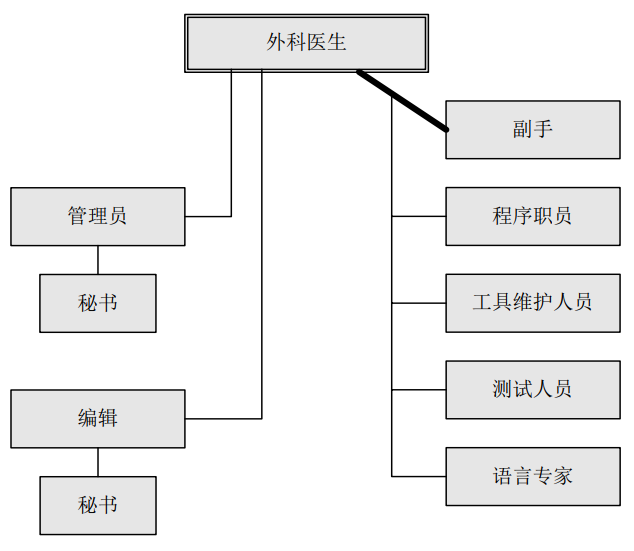

# 1 焦油坑

## 编程为什么有趣？

- 一种**创建事物的纯粹快乐**。如同小孩在玩泥巴时感到愉快一样，成年人喜欢创建事物， 特别是自己进行设计。
- 快乐来自于**开发对其他人有用的东西**。内心深处，我们期望其他人使用我们的劳动成果， 并能对他们有所帮助。
- **整个过程**体现出魔术般的力量——将相互啮合的零部件组装在一起，看到它们精妙地运行， 得到预先所希望的结果。
- **学习的乐趣**，来自于这项工作的非重复特性。
- 程序员凭空地运用自己的**想象**， 来建造自己的“城堡”，创造的方式如此得灵活， 如此得易于精炼和重建， 如此得容易实现概念上的设想

## 职业的苦恼

- 必须追求完美，以得到期望的结果
- 由他人来设定目标，供给资源，提供信息。编程人员很少能控制工作环境和工作目标
- 概念性设计是有趣的，但寻找琐碎的 bug 却只是一项重复性的活动
- 当投入了大量辛苦的劳动，产品在即将完成或者终于完成的时候， 却已显得陈旧过时

# 2 人月神话

## 2.1 乐观主义

所有的编程人员都是乐观主义者：无论是什么样的程序， 他们都认为结果是勿庸置疑的：“这次它肯定会运行。” 或者“我刚刚找出了最后一个错误。” 所以系统编程的进度安排背后的第一个假设是： **一切都将运作良好， 每一项任务仅花费它所“应该”花费的时间**。正由于介质（**思维活动**）的易于驾驭， 我们期待在实现过程中不会碰到困难， 因此造成了乐观主义的弥漫。 而我们的构思是有缺陷的， 因此总会有bug。也就是说，我们的乐观主义并不应该是理所应当的。

## 2.2 人月

我认为**用人月作为衡量一项工作的规模是一个危险和带有欺骗性的神话**。 它暗示着人员数量和时间是可以相互替换的。人数和时间的互换仅仅适用于以下情况

- 某个任务可以分解给参与人员，并且他们之间不需要相互的交流。

沟通所增加的负担由两个部分组成：**培训和相互的交流**。

- 每个成员需要进行技术、 项目目标以及总体策略上的培训。 这种培训不能分解，因此这部分增加的工作量随人员的数量呈线性增长。
- 相互之间交流的情况更糟一些。如果任务的每个部分必须分别和其他部分单独协作，则工作量按照 n(n-1)/2递增

所以在很多时候，增加更多的人手，实际上是延长了，而不是缩短了时间进度。**向进度落后的项目中增加人手，只会使进度更加落后**。

## 2.3 系统测试
对于软件任务的进度安排，以下是我使用了很多年的经验法则：

- 1/3 计划
- 1/6 编码
- 1/4 构件测试和早期系统测试
- 1/4 系统测试，所有的构件已完成

## 2.4 空泛的估算
为了满足顾客期望的日期而造成的不合理进度安排， 在软件领域中却比其他的任何工程领域要普遍得多。而且，非阶段化方法的采用， 少得可怜的数据支持， 加上完全借助软件经理的直觉，这样的方式很难生产出健壮可靠和规避风险的估计。

- 开发并推行**生产率图表、缺陷率、估算规则**等等，而整个组织最终会从这些数据的共享上获益。
- 在基于可靠基础的估算出现之前，项目经理需要挺直腰杆，坚持他们的估计，**确信自己的经验和直觉**总比从期望派生出的结果要强得多。

# 3 外科手术队伍
如果一个 200 人的项目中， 有 25 个最能干和最有开发经验的项目经理，那么开除剩下的 175 名程序员，让项目经理来编程开发。
Mills建议**大型项目的每一个部分由一个团队解决**，但是该队伍以类似外科手术的方式组建，而并非一拥而上。同每个成员截取问题某个部分的做法相反， 由一个人来进行问题的分解， 其他人给予他所需要的支持，以提高效率和生产力。

- 外科医生。 Mills称之为**首席程序员**。他亲自定义功能和性能技术说明书，设计程序，编制源代码，测试以及书写技术文档。
- 副手。他是外科医生的后备，能完成任何一部分工作，但是相对具有较少的经验。他的主要作用是作为设计的思考者、讨论者和评估人员。
- 管理员。需要一个控制财务、人员、工作地点安排和机器的专业管理人员，该管理员充当与组织中其他管理机构的接口。不需要全职，一个管理员可以为两个团队服务。
- 编辑。编辑根据外科医生的草稿或者口述的手稿，进行分析和重新组织，提供各种参考信息和书目，对多个版本进行维护以及监督文档生成的机制。
- 两个秘书。 管理员和编辑每个人需要一个秘书。管理员的秘书负责项目的协作一致和非产品文件。
- 程序职员。 他负责维护编程产品库中所有团队的技术记录。该职员接受秘书性质的培训，承担机器码文件和可读文件的相关管理责任。
- 测试人员。 测试人员既是为各个功能设计系统测试用例，同时也是为日常调试设计测试数据。他还负责计划测试的步骤和为测试搭建测试平台。
- **语言专家**。语言专家则寻找一种简洁、 有效的使用语言的方法来解决复杂、晦涩或者棘手的问题。他通常需要对技术进行一些研究（两到三天）。通常一个语言专家可以为两个到三个外科医生服务。

# 4 概念完整性

我主张在系统设计中，概念完整性应该是最重要的考虑因素。也就是说为了反映一系列连贯的设计思路，宁可省略一些不规则的特性和改进，也不提倡独立和无法整合的系统，哪怕它们其实包含着许多很好的设计。由于目标是易用性，**功能与理解上复杂程度的比值才是系统设计的最终测试标准**。 单是功能本身或者易于使用都无法成为一个好的设计评判标准。
概念的完整性要求设计必须由一个人，或者非常少数互有默契的人员来实现。而进度压力却要求很多人员来开发系统。有两种方法可以解决这种矛盾：

- 仔细地区分设计方法和具体实现
- 外科手术队伍这样一种崭新的组建编程开发团队的方法。

将设计方法、体系结构方面的工作与具体实现相**分离**是获得概念完整性的强有力方法。

# 5 贯彻执行
一句古老的格言警告说： “**决不要携带两个时钟出海，带一个或三个**。”同样的原则也适用于形式化和记叙性定义。 如果同时具有两种方式， 则必须以一种作为标准， 另一种作为辅助描述， 并照此明确地进行划分。它们都可以作为表达的标准。
显然，对于存有疑问的实现人员，应鼓励他们打电话询问相应的结构师，而不是一边自行猜测一边工作， 这是一项很基本的措施。

# 6 为什么巴比伦塔会失败
团队如何进行相互之间的交流沟通：

-  非正式途径：清晰定义小组内部的相互关系和充分利用电话，能鼓励大量的电话沟通，从而达到对所书写文档的共同理解。
- 会议：会议中， 团队一个接一个地进行简要的技术陈述。 这种方式非常有用，能澄清成百上千的细小误解
- 工作手册：在项目的开始阶段，应该准备正式的项目工作手册（即feature binder）

团队组织的目的是减少不必要交流和合作的数量， 因此良好的团队组织是解决上述交流问题的关键措施。减少交流的方法是**人力划分（division of labor）和限定职责范围（specializationof function）**。交流和交流的结果——组织， 是成功的关键。 交流和组织的技能需要管理者仔细考虑， 相关经验的积累和能力的提高同软件技术本身一样重要。

# 7 削足适履

## 7.1 规模控制
应该从整体上来进行评价。 没有人可以在自始至终提倡更紧密的软硬件设计集成的同时， 又仅仅就规模本身对软件系统提出批评。规模是软件系统产品用户成本中如此大的一个组成部分，开发人员必须设置规模的目标， 控制规模， 考虑减小规模的方法， 就像硬件开发人员会设立元器件数量目标， 控制元器件的数量， 想出一些减少零件的方法。 同任何开销一样， **规模本身不是坏事， 但不必要的规模是不可取的**。

对项目经理而言，规模控制既是技术工作的一部分，也是管理工作的一部分。在整个实现的过程期间， 系统结构师必须保持持续的警觉， 确保连贯的系统完整性。 在这种监督机制之外， 是实现人员自身的态度问题。 培养开发人员从系统整体出发、 面向用户的态度是软件编程管理人员最重要的职能。

## 7.2 空间技能
项目经理可以做两件事来帮助他的团队取得良好的空间－时间折衷。

- 一是确保他们在编程技能上得到培训， 而不仅仅是依赖他们自己掌握的知识和先前的经验。 特别是使用新语言或者新机器时， 培训显得尤其重要
- 另外一种方法是认识到编程需要技术积累，需要开发很多公共单元构件。每个项目要有能用于队列、搜索和排序的例程或者宏库。对于每项功能，库至少应该有两个程序实现：运行速度较快和短小精炼的。

# 8 为什么需要正式文档

- 书面记录决策是必要的。只有记录下来，分歧才会明朗，矛盾才会突出。
- 文档能够作为同其他人的沟通渠道。项目经理常常会不断发现，许多理应被普遍认同的策略， 完全不为团队的一些成员所知。文档能极大地减轻负担。
- 项目经理的文档可以作为数据基础和检查列表。通过周期性的回顾，他能清楚项目所处的状态，以及哪些需要重点进行更改和调整。

**项目经理的任务是制订计划，并根据计划实现**。但是只有书面计划是精确和可以沟通的。 计划中包括了时间、 地点、 人物、 做什么、 资金。 这些少量的关键文档封装了一些项目经理的工作。 如果一开始就认识到它们的普遍性和重要性， 那么就可以**将文档作为工具友好地利用起来， 而不会让它成为令人厌烦的繁重任务**。 通过遵循文档开展工作， 项目经理能更清晰和快速地设定自己的方向。

# 9 未雨绸缪

## 9.1 唯一不变的就是变化本身
第一步是接受这样的事实： 变化是与生俱来的， 不是不合时宜和令人生厌的异常情况。

 不但目标上的变化不可避免， 而且设计策略和技术上的变化也不可避免。 抛弃原型概念本身就是对事实的接受——随着学习的过程更改设计。
