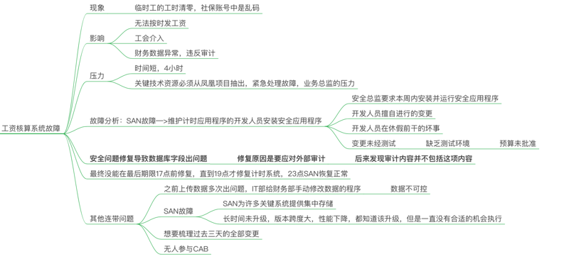
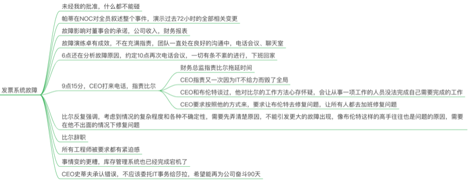
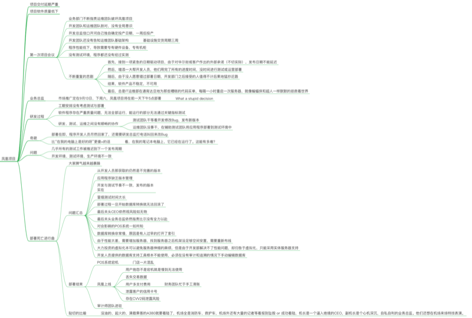
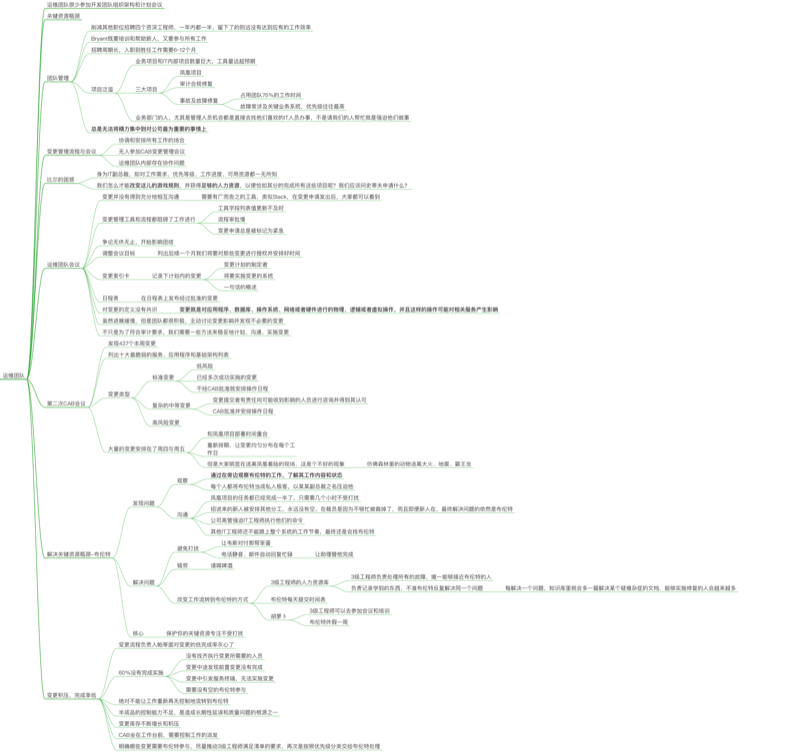
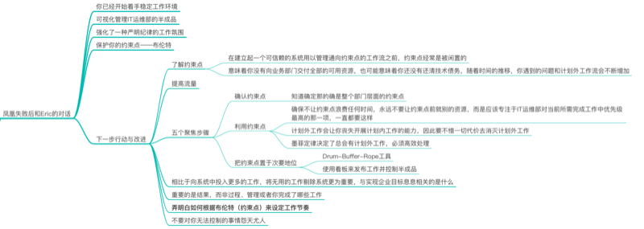
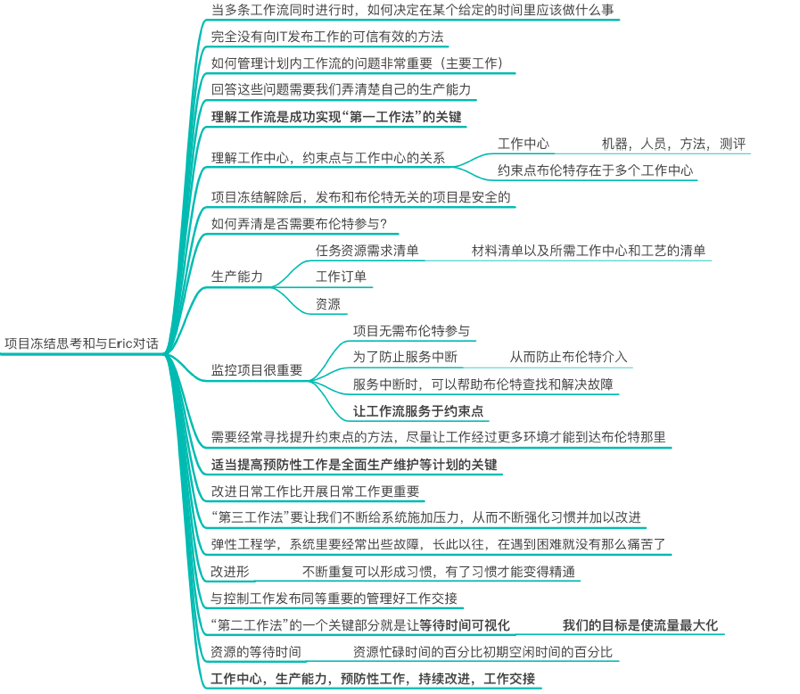
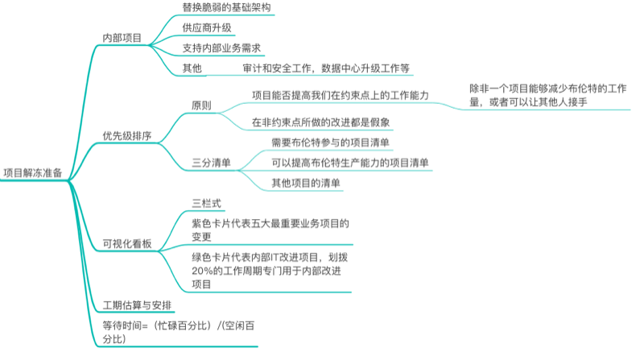
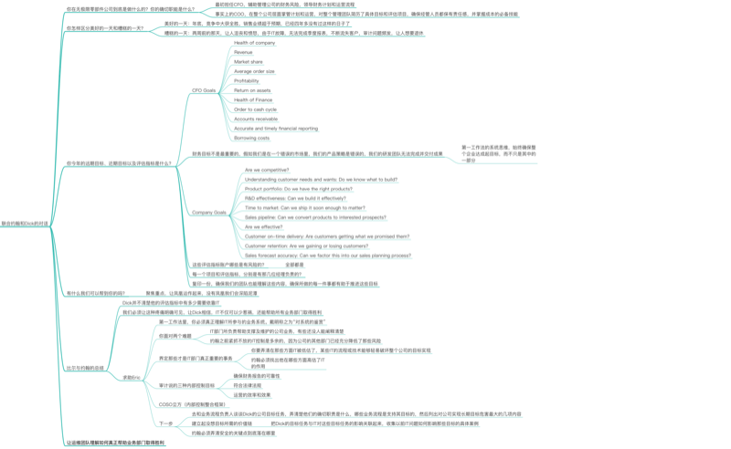
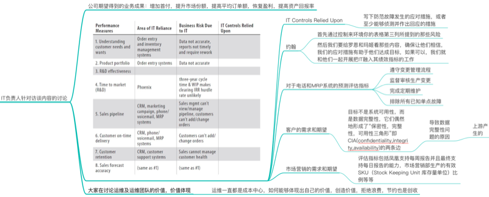
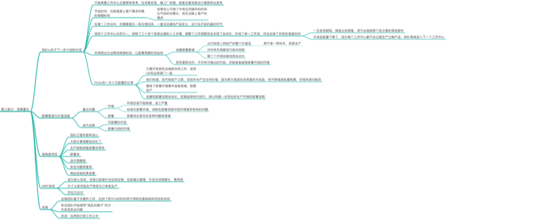

# 简介
《凤凰项目—一个IT运维的传奇故事》由Gene Lee等三位运维领域的大牛编写而成，讲述无极限汽车零件公司如何在痛苦中通过团队的努力，共同实践三步工作法实现浴火重生的故事。三位作者现在都是公司管理层，所以书中既有运维工程师微观视角，也有管理者的宏观视角。Ruddy Lee老师说他跟工程师打赌，工程师一般都翻不到几页也就不读了，原因是**大家都有阅读焦虑症，日记小说般的结构无法快速的找到技术重点**。我也觉得工程师很难读完第一部分，原因是工程师大多会恨得牙痒痒，把书撕了！里边有太多我们曾经经历过的场景，那些让我们痛不欲生的经历。

整本小说的主人公叫做比尔，担任运维总监的角色，比尔通过自己的努力，让运维部、开发部、测试部、业务部门联合起来，为公司实现了业务的成功。所以小说的视角主要是在运维领域。在任命比尔担任IT运维负责人（运维总监）之后，CEO提出的期望：IT系统运行可靠高效，为业务部门提供保障，尽量减少运维中的故障，让业务部门集中精力完成凤凰项目**运维分工**分布式技术运营。

# 第一部分：人间炼狱
我将第一部分命名为：**人间炼狱**。这个阶段里，运维故障天天有，争吵、指责、敌对充斥着每天的工作。根据时间线，我整理了如下的问题：

## 1. 公司整体问题

1. 前任CEO重掌董事会，公司管理层动荡，目标不一致
1. 股东打算拆分公司
1. 业务总监阴谋私下联合董事会反对运维改进
1. 既要保持竞争力，又要削减成本
1. 公司经过多轮裁员，人心不稳
1. 公司市场占有率下降
1. 公司股价下跌严重
1. 业务总监利用凤凰上线预期效果绑架CEO的决策

## 2. 运维管理问题

1. 业务总监反对
1. 高管变动太快
1. CIO和运维总监离职
1. CIO=Career Is Over
1. IT预算和人员申请总是被驳回
1. 培养人太难
1. 运维关键资源一直是瓶颈
1. CEO支持力度小
1. 不正视资源与任务的失衡，不正视凤凰项目面临的巨大风险
1. 不给资源，只派活
1. CEO被业务总监灌了迷魂汤

## 3. 运维问题

### 1. 计划外故障

1. **工资核算系统故障**

主人公临危受命，第一个要解决的问题就是工资核算系统的故障，这次经历让比尔认识到运维团队现在乱的像一锅粥。重点内容如下图所示：**重点问题：没有实质上的变更管理，运维工作处于失控状态**

2. **SOX-404审计合规问题**

紧接着，比尔就遇到了第二个问题，疲于奔命，到处救火，这就是很多运维团队的真实写照。这件事之后，主人公尝试向CEO申请更多的资源，希望将重点放在凤凰项目上，得到的答案是没有资源，所有任务都要完成。**重点问题：运维团队超负荷工作，没有资源，尤其是关键资源一直处于饱和状态。作为运维总监，比尔对团队的工作内容与状态一无所知**

3. **1级严重级别事故：信用卡处理系统故障**

**重点问题：此次事故充分暴露了运维团队缺乏事故处理机制与预案，团队缺乏信任，推卸责任严重。过度依赖关键资源**

4. **其他故障**

**重点问题：IT****设备采购周期太长**这个问题在大部分公司里都存在，随着云计算（公有云和私有云）的成熟与普及，能降低IT设备采购对生产系统的影响

5. **发票系统故障**

这是直接导致主人公和CEO闹翻，最终辞职的一次事故，发生在凤凰上线部署之后。这次事故也让无极限遭受极大损失。**重点问题：CEO****无视运维的基本规律，擅自干涉运维工程师的工作，逼迫工程师瞎忙碌**曾经听说因为某次事故，CEO将整个运维团队开除的情况（未经核实）。运维一直被视为成本中心，在企业组织中的价值不容易体现，老王根据精益提出的两点：拒绝浪费、创造价值，很好诠释了运维团队需要坚持的原则。

### 2. 凤凰项目
凤凰项目是这个公司的希望，更是一场灾难，在小说第二部分甚至得出结论，凤凰项目就不该被批准。**重点问题：这是我见过的最有代表性的项目，艺术源于生活而高于生活，凤凰项目基本集齐了所有我们遇见的项目问题，延期，质量低下，着急上线，环境不一致，未经测试，互相指责，工期不考虑测试与部署。差点就召唤出神龙了，具体请看图**

### 3.运维流程

- 过于复杂陈旧
- 无人遵守流程:
- 申请生产环境变更到实施的周期太长

### 4. 黑锅王
往来邮件必称“由于IT故障”

### 5. 关键资源瓶颈

- 关键资源总是受到外界打扰
- 不会记录故障处理方式（缺乏文档化，知识共享）

## 4. 团队管理与协作问题

### 1. 运维团队
**重点问题：**

1. **运维团队不参与研发团队的架构和计划会议**：DevOps在组织文化层面强调团队共同Share Responsibility，需要运维与研发相互之间进行反馈，运维团队参与架构和计划会议是明智的举动，这样才能设计出易于运维、高可用、安全的架构
1. **关键资源管理**：项目管理中有关键路径法用于制定计划，最长的路径决定了项目的整体进度。关键资源总是处在关键路径上，而且是多条路径上。小说中提到了"等待时间=忙碌百分比/空闲百分比"，工作中心资源90%的时间是忙碌的，可以理解为，每个任务进行工作中心时，前边总有需要90%时间的任务，1天10小时，需要等待9小时才能处理。关于关键资源瓶颈的解决办法，重点在保护关键资源，图中可以看到一些解决办法和寻找问题的方法（观察+沟通）
1. **项目泛滥，资源严重不足**：比尔上任初始，最大的行动就是对现有项目的梳理，流程的重组优化。
1. **变更管理流程失效**：看板是解决变更管理和可视化工作的重点方法，对变更进行分类和管控，严控半成品
1. **运维对开发的认识**是：没有不给生产环境添乱的开发人员

这个和运维与开发的基本目标有关，为什么Dev和Ops存在壁垒和矛盾，Dev求变，希望更多的变更，交付等多的代码，而Ops求稳，希望生产环境尽量不发生变化，这样服务可用性采用保障。考核的目标不同，自然会有冲突。Google SRE提出的“错误预算”在此间找到了一个平衡。

### 2. 开发团队
**重点问题：研发过程依然是没有价值可言的，业务人员缺乏IT****常识是致命的，从这可以看出整个公司几乎不存在协作氛围，团队之间缺乏基本的信任和依赖**

### 3. 安全团队
安全团队最大的问题就是**没有整体思维，只关注安全问题，忽略整体利益**安全应该是视为质量的一部分，内建于开发过程

## 5. 思考和改进
关于运维的四类工作的划分：

1. 内部项目（IT基础架构项目）
1. 业务项目
1. 变更
1. 比尔上任后的主要工作
1. 预防计划外工作的产生
   1. 更好地协调变更，以免它们失败
   1. 确保对事故和服务中断的有序处理，以免妨碍关键资源
6. 计划外工作（反工作）
6. 计划外工作是恢复性工作，几乎总是让你远离目标
6. 知道你的计划外工作从和而来就显得尤为重要

**金句：**

1. 预防措施有个问题，就是你很少能知道自己究竟避开了哪些灾难

# 第二部分：改邪归正
我将第二部分命名为：**改邪归正**。在这个阶段里，运维、开发、测试、安全团队携手合作，将凤凰平稳向前推进。这部分更重要的一点是，IT团队对业务目标的理解以及IT系统与业务目标的对应关系有了深刻的认识。什么系统更重要，为什么要上线监控系统的背后逻辑是公司的业务目标。寻找改变的方向：凤凰失败后的对话

## 1. 破冰会议

1. 信任是非常重要的，
1. 运维团队需要限制在制品数量，提高整个系统的流量
1. 大胆的举动：冻结除已知重要以外的所有工作

## 2. 如何提高流量：项目冻结后的对话

1. 监控很重要，可以提高预防性
1. 可视化资源的等待时间
1. 基于约束点，最大化流量

## 3. 基于约束点的优先级排序：项目解决准备

## 4. 运维的本质：帮助业务实现成功
和COO的对话，让比尔了解了运维的本质，任何的决定都是围绕业务的成功，比尔需要弄清楚哪些业务对应着哪些IT系统，哪些很重要，怎么和业务协作来优化运维管理。

## 5. 运维与业务的融合
运维团队对公司的业务目标达成一致，关键业务以及对应的IT系统，主要风险，对应的改进措施

# 第三部分：涅槃重生
我将第三部分总结为“**涅槃重生**”，我想这也就是作者将书名叫做凤凰项目的原因，在这个阶段，比尔带领研发团队、运维团队、测试团队和业务团队一起快速交付了独角兽项目。为公司实现了盈利，赢得了竞争。

## 1. 价值流图
从代码提交，到上线运营的全流程如图所示，针对自己项目的详细分析，完成价值流图梳理和设计，可以帮助我们识别主要问题环境，优化价值流速

## 2. 持续改进
让团队形成持续的竞争力

# 后记

## 三步工作法
**【第一步】**帮助我们理解在工作从开发部移向IT运维部时该如何建立快速工作流，因为那就是业务部门与客户之间的衔接。第一工作法是关于从开发到技术运营，再到客户的整个自左向右的工作流。为了使**流量最大化**，我们需要**小的批量规模和工作间隔**，绝不让缺陷流向下游工作中心，并且不断为了**整体目标**（相对于开发功能完成率、测试发现/修复比例或运维有效性等局部目标）进行优化。实践：持续构建、持续集成、持续部署，按需创建环境、限制半成品，构建起能够顺利变更的安全系统和组织。

**【第二步】**告诉我们如何缩短及放大反馈环路，从而在源头上解决质量问题，避免返工第二工作法是关于价值流各阶段自右向左的快速持续**反馈**流，方法其效益以确保防治问题再次发生，或者更快地发现和修复问题。这样，我们就能在所需之处获取或嵌入知识，从源头上保证质量。 实践：

- 在部署管道中的构建和测试失败时“停止生产线”
- 日复一日持续的改进日常工作
- 创建快速的自动化测试套装软件，以确保代码总是处于可部署的状态
- 在开发和技术运营之间建立共同的目标和共同的解决问题的机制
- 建立普遍的产品**遥测**技术，让每个人都能知道，产品和环境是否在按设定的运行，以及是否达到了客户的目标

**【第三步】**告诉我们如何建立一种文化，既能鼓励探索，从失败中吸取教训，又能理解反复的实践是精通工作的先决条件。第三工作法是关于创造公司文化，该文化可带动两中风气的形成：

- 不断尝试，这需要承担风险并从成功和失败中吸取经验教训
- 理解重复和联系是熟练掌握的前提 尝试和承担风险让我们能够不懈地改进工作系统，这经常要求我们去做一些和以往做法大不相同的事。一旦出现问题，不断重复的日常操作赋予我们的技能和经验，令我们可以撤回至安全区域并恢复正常运作

**【实践】**

- 营造一种勇于创新、敢于冒险（相对于畏惧和盲目服从命令）以及高度信任（相对于低信任度和命令控制）的文化
- 把至少20%的开发和技术运营周期划拨给非功能性需求，并且不断鼓励进行改进

## 思考

1. 如果不是比尔会怎样？比尔是公司的老员工，对公司有责任感，对公司员工有感情，否则在如此内忧外患，谁还愿意苦苦支撑。在凤凰项目部署前的最后时刻，依然不抛弃不放弃的劝说CEO、业务总监推迟发布
1. 比尔为什么上任后一定要首先搞定变更管理，**因为计划外工作会毁了一切，而能扼住其咽喉的只有变更管理**
1. 关于团队建设
1. T型人才
1. 梯形队伍

 
