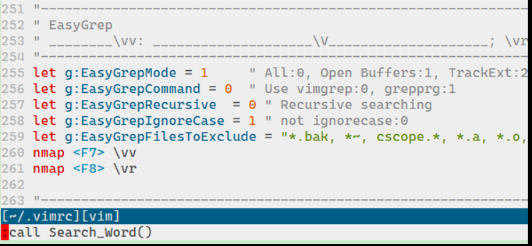
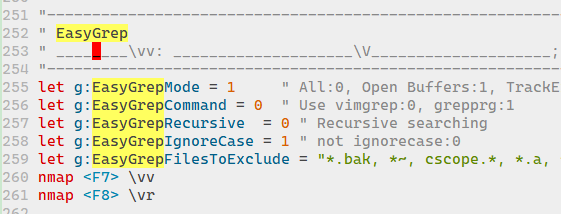

# 1. Ag的优点
> 有句话说：`grep`为了搜索而生,`ack`为搜索源码而生。

grep最常用，但是有些功能却不支持，而AG正好弥补了这些缺点：

1. 为代码搜索而定制 搜索时默认会忽略”.svn”,”.git”,”CVS”目录,备份文件,二进制文件,core文件等,真是为源码而生.如果觉得还不够,可以在配置文件中设置.
1. 默认为递归搜索 源码搜索一般确实都是递归的!
1. 可以指定搜索的源码类型 可以通过参数`--xxx`来指定源码类型,比如`--python`,`--perl`等
1. 参数基本与grep一样 大部分参数与grep保持一致
1. 存在vim插件(ack.vim),可以方便的通过vim来调用
1. ack比grep少一个一个字符.而且排序上ack要比grep靠前多


# 2. Ag的基本命令

- ag -g <File Name> 类似于 find . -name <File Name>
- ag -i PATTERN： 忽略大小写搜索含PATTERN文本
- ag -A PATTERN：搜索含PATTERN文本，并显示匹配内容之后的n行文本，例如：ag -A 5  abc会显示搜索到的包含abc的行以及它之后5行的文本信息。
- ag -B PATTERN：搜索含PATTERN文本，并显示匹配内容之前的n行文本
- ag -C PATTERN：搜索含PATTERN文本，并同时显示匹配内容以及它前后各n行文本的内容。
- ag --ignore-dir <Dir Name>：忽略某些文件目录进行搜索。
- ag -w PATTERN： 全匹配搜索，只搜索与所搜内容完全匹配的文本。
- ag --java PATTERN： 在java文件中搜索含PATTERN的文本。
- ag --xml PATTERN：在XML文件中搜索含PATTERN的文本。


# 3. VIM+Ag插件
Ag插件的repo为：[https://github.com/rking/ag.vim](https://github.com/rking/ag.vim)你可以手动下载放置到VIM的插件目录中，也可以通过Plug插件管理器自动下载：

```
Plug 'rking/ag.vim'
```

基本配置：

```
" let g:ag_prg = 'ag --nogroup --nocolor --column' "自定义命令
" let g:ag_working_path_mode="r"  "启动根目录作为搜索root
let g:ag_highlight=1 "高亮
"设置快捷键
nmap ag :Ag
nmap agw :call Search_Word()<cr>
function Search_Word()
    let w = expand("<cword>")
    execute "Ag " . w
endfunction
```

鼠标光标放在要搜索的单词上，输入agw快捷键，就可以看到vim命令栏正在调用我们自定义的函数：
回车之后，开始搜索，当前文件中匹配的内容会被高亮，如果有多个文件找到搜索结果，会在quickFix窗口中列出：
