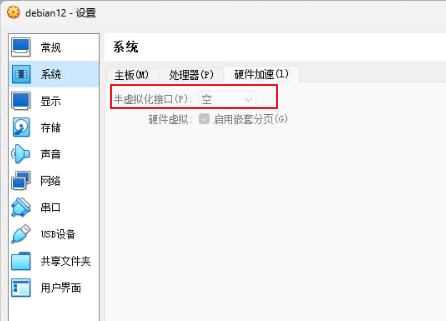

# 安装

## virtualbox efi 下安装失败

debian12 在 virtualbox 选择**启用 EFI**时回安装失败, 需要

1. 将硬件加速页面下**半虚拟化接口**设置为空, 然后执行安装过程.
1. 安装完成后再将配置改为原来的值.



## debian 安装时 btrfs 子卷设置

手动分区情况:

- /boot/efi: 512MB, fat32/vfat
- /boot: 1GB, ext4. **不使用 LVM 时可以不单独分区，在根分区内**
- /swap: 8GB, swap. **可以不单独分区, 用 swapfile 代替**
- /: 所有空间， btrfs

在手动分区修改结束后, 按 ctrl+alt+F2 进入终端, 执行如下命令后再返回图形界面继续安装系统(**只安装基本系统即可，不要联网**).

```bash
~ # umount /target/boot/efi
~ # umount /target/boot
~ # umount /target

# 挂载btrfs分区到/mnt
~ # mount /dev/sda3 /mnt

# 创建子卷
~ # cd /mnt
~ # mv @rootfs @
~ # btrfs subvolume create @home
~ # btrfs subvolume create @snapshots

# 卸载/mnt
~ # cd
~ # umount /mnt

# 挂载子卷
~ # mount -o rw,noatime,space_cache=v2,compress=zstd,ssd,discard=async,subvol=@ /dev/sda3 /target
~ # mkdir /target/home
~ # mount -o rw,noatime,space_cache=v2,compress=zstd,ssd,discard=async,subvol=@home /dev/sda3 /target/home
~ # mkdir /target/snapshots
~ # mount -o rw,noatime,space_cache=v2,compress=zstd,ssd,discard=async,subvol=@snapshots /dev/sda3 /target/snapshots

# 挂载efi和boot分区
~ # mount /dev/sda2 /target/boot/
~ # mount /dev/sda1 /target/boot/efi

# 修改fstab自动挂载, uuid还是用原来/dev/sda3的值
UUID=2fd5d7b2-ceb0-4028-8381-3b38b3dcd658 /               btrfs   rw,noatime,space_cache=v2,compress=zstd,ssd,discard=async,subvol=@ 0       0
UUID=2fd5d7b2-ceb0-4028-8381-3b38b3dcd658 /home           btrfs   rw,noatime,space_cache=v2,compress=zstd,ssd,discard=async,subvol=@home 0       0
UUID=2fd5d7b2-ceb0-4028-8381-3b38b3dcd658 /snapshots      btrfs   rw,noatime,space_cache=v2,compress=zstd,ssd,discard=async,subvol=@snapshots 0       0
```

## 终端下联网

1. 保证要连接的路由器是可以扫描到的，**不能是隐藏的**
1. `iwconfig`查看 wifi 网卡的名称
1. 修改`/etc/network/interfaces`中 wifi 网卡, 添加要连接的 ssid 和 psk

```
allow-hotplug wlan0
iface wlan0 inet dhcp
    wpa-ssid 你的wifi名称
    wpa-psk 你的wifi密码
```

4. 运行`ifup wlan0`连接网络

## 安装 gnome-core

安装 gnome 最小化桌面环境, 直接安装**gnome-core**

# 系统设置

## networkmanager 找不到 wifi 问题

最近重装 Debian 12，配置 NetworkManager 的过程中遇到了无法找到无线网络的问题，在此记录一下解决方法:

全新安装 Debian 12 后，**网络连接默认不由 NetworkManager 管理**，

1. 需要手动修改`/etc/NetworkManager`目录下的配置文件 NetworkManager.conf，将 ifupdown 段的 managed 修改为 true，然后` sudo systemctl restart NetworkManager` 重启服务
1. 修改`/etc/network/interfaces`，**注释掉无线网卡的 iface 配置行**，保留接口声明，然后分别重启 networking、wpa_supplicant 和 NetworkManager 服务

## vsyscall 默认不支持导致 segmentation fault

1. 在`/etc/default/grub`最后添加配置: `GRUB_CMDLINE_LINUX_DEFAULT=vsyscall=emulate`
1. 执行`update-grub`更新配置
1. 重启系统即可, 使用`cat /proc/self/maps`可以看到 vsyscall

## pip error externally-managed-environment

生成一个虚拟环境，能够帮助我们防止和 linux 内置的 python 包搞混乱:

```bash
#安装虚拟环境 venv
sudo apt install python3-venv

#生成虚拟环境, 这样就可以生成指定名称 .venv 的虚拟环境文件
python3 -m venv .venv

#进入虚拟环境
source ./.venv/bin/activate

#退出虚拟环境 venv: 执行命令：deactivate
```

## 普通用户不能使用 sudo

将用户加入到 sudo group 中：

```bash
usermod -aG sudo username
groups username
```

## 支持允许 32 位程序

```bash
sudo dpkg --add-architecture i386
sudo apt update
sudo apt install lib32z1
```

## 时间同步失败

出现下面情况， 说明没有安装 ntp 服务, 而且会影响`apt update`:

```bash
$ timedatectl
               Local time: 五 2024-03-08 09:11:55 CST
           Universal time: 五 2024-03-08 01:11:55 UTC
                 RTC time: 四 2024-03-07 11:03:20
                Time zone: Asia/Shanghai (CST, +0800)
System clock synchronized: no
              NTP service: n/a  #ntp不可用
          RTC in local TZ: no
```

需要安装 ntp 服务, 下面两个选择一个即可:

- chrony: 基于 NTP 协议, 功能全面
- systemd-timesyncd: 基于 SMTP 协议, 功能单一

```bash
$ sudo apt install chrony
$ sudo apt install systemd-timesyncd

$ timedatectl
               Local time: 五 2024-03-08 09:18:43 CST
           Universal time: 五 2024-03-08 01:18:43 UTC
                 RTC time: 五 2024-03-08 01:18:43
                Time zone: Asia/Shanghai (CST, +0800)
System clock synchronized: yes
              NTP service: active
          RTC in local TZ: no
```

## 安装 backports 内核

Backport 的含义是”向后移植”，就是将软件新版本的某些功能移植到旧版本上来, 因此要使用新内核需要先保证 apt 源中已经添加了 backports 源.

```bash
# 安装新内核
sudo apt -t buster-backports install linux-image-amd64
sudo apt -t buster-backports install linux-headers-amd64
sudo update-grub
sudo reboot

# 查询内核镜像和头文件, 再apt卸载不需要的版本
dpkg --list | grep linux-image
dpkg --list | grep linux-headers
```

## 安装 nvidia 驱动

1. 先禁用开源的 nonveau 驱动

```bash
sudo vi /etc/modprobe.d/blacklist-nouveau.conf
# 添加如下两行
blacklist nouveau
options nouveau modeset=0

# 更新initramfs
sudo update-initramfs -u

sudo vi /etc/default/grub
#增加modprobe.blacklist=nouveau
GRUB_CMDLINE_LINUX="modprobe.blacklist=nouveau"
# 更新grub
sudo update-grub

#重启系统
sudo reboot
```

2. 安装`nvidia-detect`, 运行此命令查看推荐的驱动版本
3. 保证内核对应版本的 linux-headers 已经安装, 没有的话先安装
4. 按照 debian wiki, 按照如下包:

```bash
sudo apt install nvidia-driver firmware-misc-nonfree

# CUDA
sudo apt install nvidia-cuda-dev nvidia-cuda-toolkit
```

5. 之后运行`nvidia-smi`看到显卡信息说明安装成功

# gnome 设置

## 必备扩展

- gnome-extension-app: 开启扩展功能及内置的一些扩展
- Blur-My-Shell: 让面板, 顶栏, Overview, 锁屏, gnome 自带的截屏, 甚至特定的 app, 都能被毛玻璃化
- Appindicator: 显示托盘图标
- Clipboard Indicator: 剪贴板历史记录
- Dash to Panel: 将 dash 和 gnome 顶栏合并, 类似任务栏

## 最大化最小化按钮

- gnome-tweaks
- 命令: `gsettings set org.gnome.desktop.wm.preferences button-layout ":minimize,maximize,close"`

## 系统字体大小

- gnome-tweaks
- 命令: `gsettings set org.gnome.desktop.interface text-scaling-factor 1.25`
