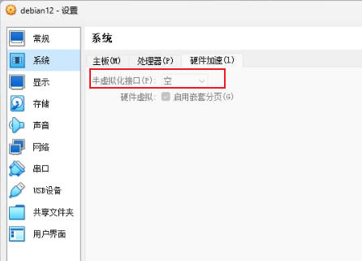

# virtualbox efi 下安装失败

debian12 在 virtualbox 选择**启用 EFI**时回安装失败, 需要

1. 将硬件加速页面下**半虚拟化接口**设置为空, 然后执行安装过程.
1. 安装完成后再将配置改为原来的值.

# networkmanager 找不到 wifi 问题

最近重装 Debian 12，配置 NetworkManager 的过程中遇到了无法找到无线网络的问题，在此记录一下解决方法:

全新安装 Debian 12 后，**网络连接默认不由 NetworkManager 管理**，

1. 需要手动修改`/etc/NetworkManager`目录下的配置文件 NetworkManager.conf，将 ifupdown 段的 managed 修改为 true，然后` sudo systemctl restart NetworkManager` 重启服务
1. 修改`/etc/network/interfaces`，注释掉无线网卡的 iface 配置行，保留接口声明，然后分别重启 networking、wpa_supplicant 和 NetworkManager 服务

# vsyscall 默认不支持导致 segmentation fault

1. 在`/etc/default/grub`最后添加配置: `GRUB_CMDLINE_LINUX_DEFAULT=vsyscall-emulate`
1. 执行`update-grub`更新配置
1. 重启系统即可, 使用`cat /proc/self/maps`可以看到 vsyscall
