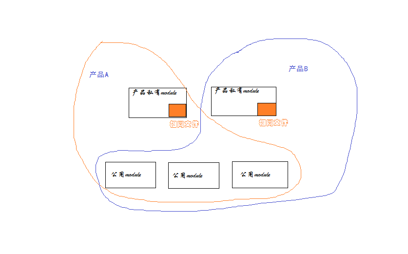
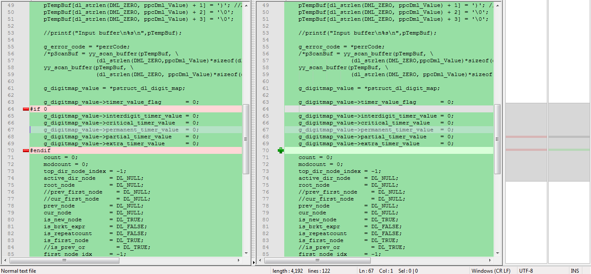

## 前言

软件开发者debug程序是家常便饭，然而有时候也会遇到让你丈二和尚摸不着头脑的问题。你会在心中纳闷：“怎么会这样呢？”“这个地方我明明加了限制啊”“见鬼了吧，一样的步骤结果不一样？？”
有时候这些bug最终发现都是很简单的原因导致的，于是恍然大悟，原来是这样。虽然问题解决了，但是这并不能说明你有所成长，下次遇到这样的问题，你的思路用变化吗？还是说仍旧是check好几天，哀声遍野，然后恍然大悟？
我想说的是，问题解决不重要，思考方式有所变化，下次能用更短的时间解决问题，才最为重要。
今天，我就遇到了这样一个让我受益匪浅的问题，来此分享一下。


## 问题

公司有两套产品，基本架构是一样的，所以很多的module是公用的，只有一小部分模块因为逻辑变化较大分成了单独的module，但是这些模块中仍有小部分代码是一样的功能。因此某些文件就出现了两份（这在大的产品中这很正常吧！），画了一个简单的图阐述一下：


而问题就这么出现了，简化来说是这样的：
产品Ａ和产品Ｂ接受共同的配置，标准的配置时两个产品都正常处理，并且对业务没有任何影响。
而测试人员配置了一个很长的字符串配置，两个产品都报错了（这是不合法的）。产品针对这个配置项的基本逻辑是：虽然你输入的不合法，我会警告你，但是我仍然会尝试去解析这个配置，不然会导致其他的配置无法生效。而问题出现了，产品A和B都报错了，这是OK的。但是产品B却在后台上报了一个配置项解析错误的error，直接导致某个电话业务失败了；于此同时，产品A却一切正常。

好吧，我也知道是某个小差别引起的，幸好产品A是好的，对应着查吧！


## 捉虫历程

1. 难道是这个字符串太长，两个产品最后读取到的字符串不一致，从而走向了不同的处理？
打印一下读取到系统里时，这个字符串是什么样的（额，完全一样）：

```cpp
产品Ａ：
length:109
xxxxxxxx|1234567890123456789012345678901234567890123456789012345678901234567890123456789012345678901234567811
```

```
产品Ｂ:
length:109
xxxxxxxx|1234567890123456789012345678901234567890123456789012345678901234567890123456789012345678901234567811
```

2. 产品A是好的，产品B不OK，说明两个产品某个步骤操作的时候有差别，问题在产品私有的的module，且在相同的那部分文件里(因为是处理同一个东西嘛）。
肯定是后来的产品开发特性的不同，使得一开始相同的文件出现了不一致，导致问题现象有问题。
查看一下处理流程吧，都是把上面的字符串放到下面这个函数进行处理，函数的第二个参数是一个out的返回值。解析正常，返回的是有效值；解析失败返回的是NULL.
额，函数调用几乎一模一样，没区别。

```cpp
//产品A:
retVal = (Aal_ty_retVal)decode_value(pGlbMap, &(pGlbmapVxx[dpIndex].xxxmapValue), &dError);
```

```cpp
//产品B
rval = (Bal_ty_retVal)decode_value(pGlbMap, &(pGlbmapVxx[dp_index].xxxmapValue), &dError);
```

3. 既然调用没问题，那应该是decode_value函数的具体实现不一样吧？
额，除了去除了一点不支持的变量，没区别了。

3. 好吧，我没辙了，要不把文件夹理所有文件都diff一遍吧？
也完全一样，额，冷静一下。


## 原因

最后在他人协助下，终于发现问题：
decode_value函数中有一段处理：

```cpp
count++;
if (count >= DL_MAX_STR_ELEMS)
{
    g_error_code = E_DML_TOOMANY_R_COUNT;
    YYABORT;
}
```

在这段处理中，对count加1，并做一个if判断，看上去没什么区别对吧？But，问题偏偏在这里，与count做判断的一个宏定义DL_MAX_STR_ELEMS有问题啊，DL_MAX_STR_ELEMS在产品A和产品B中定义的值不一样！！！

```
产品A:
#define DL_MAX_STR_ELEMS 100
```

```
产品B：
#define DL_MAX_STR_ELEMS 32
```

就是这个原因，导致一段很长的配置字符串，在产品A上没有超过100个字符，成功解析，而产品B解析失败。


## 结论

感受颇多，最大的感受是，寻找bug，思路要变化。
如果两个产品或多个产品有着基本相同的处理，但最终结果不同，其原因获取不仅仅是多个处理或少个处理的问题。
**更大的可能是某些预定义的常量针对产品不同有不同的值，在if、switch和循环等地方走向了不同的处理。仅仅比较函数 code是否一致是没有用的，关键是check存在流程分流的地方是否走的是同一走向.**

---

