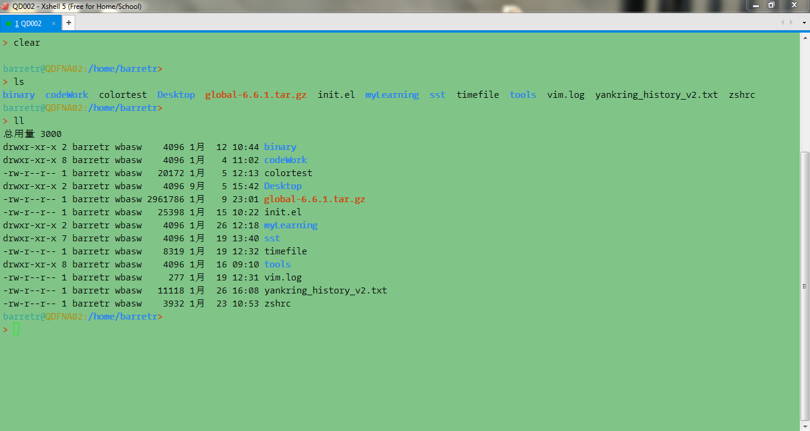
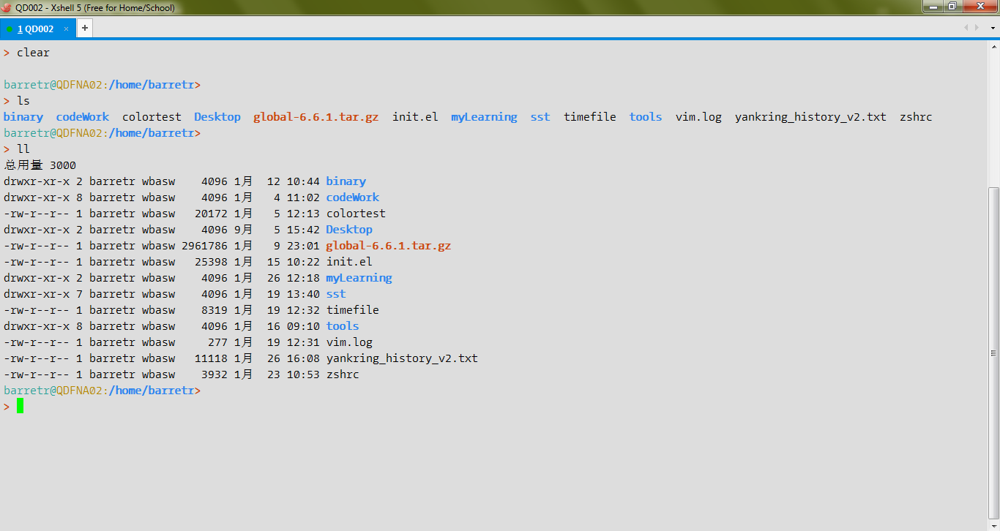

Xshell是著名的SSH/Telnet 连接客户端软件，以其简单配置和功能多样的特点闻名。诸多的IT管理人员和软件开发人员都将其作为工作的首选。
其中Xshell更以灵活多变的主题配置吸引了不少的IT工作者（在此吐槽一下Putty/Securecrt/Motaxterm等软件，配置个主题太麻烦了），每个人都可以根据自己的喜好定义主题，当然也可以下载别人定义好的主题一键导入。

这里分享一下我自己在工作中根据需要自定义的两款主题，分别是传统的绿色护眼主题和浅灰色mac风的主题。话说网上大多是深黑颜色的主题，颇有装B的嫌疑（这跟大白天穿个夜行衣有什么区别）。而且大白天盯着个黑色背景，我没感觉有多拉风，只感觉自己的眼睛闪着“异样的光”。

晚上看深色系主题是不错，白天背景当然浅色系的好了！
好了，开始我的炫耀时间。

---


### 绿色护眼主题

主题配置如下，全盘复制保存成.xcs文件，然后导入到Xshell中即可。

```cpp
[light green]
text=000000
cyan(bold)=5a6969
text(bold)=000000
magenta=dd3682
green=218d05
green(bold)=228211
background=80c488
cyan=2aa198
red(bold)=cb4b16
yellow=b58900
magenta(bold)=6c71c4
yellow(bold)=657b83
red=dc322f
white=eee8d5
blue(bold)=3086ef
white(bold)=fdf6e3
black=002b36
blue=4359f8
black(bold)=073642
[Names]
name0=light green
count=1
```

见证奇迹的时刻，它长这个样子：

---


### 浅灰极客主题

主题配置如下，全盘复制保存成.xcs文件，然后导入到Xshell中即可。

```
[Gray]
text=000000
cyan(bold)=5a6969
text(bold)=000000
magenta=dd3682
green=218d05
green(bold)=228211
background=dddddd
cyan=2aa198
red(bold)=cb4b16
yellow=b58900
magenta(bold)=6c71c4
yellow(bold)=657b83
red=dc322f
white=eee8d5
blue(bold)=3086ef
white(bold)=fdf6e3
black=002b36
blue=4359f8
black(bold)=073642
[Names]
name0=Gray
count=1
```

再次见证奇迹的时刻，和xshell的标签栏浑然一体有没有?

---

