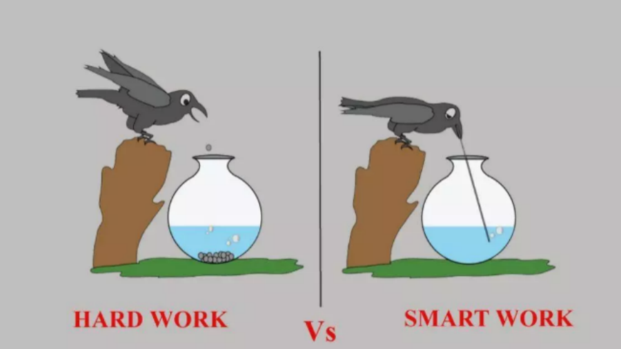

#  [就现实而谈：程序员“努力就会成功”？真相残酷但又不得不面对！](https://my.oschina.net/u/4139951/blog/3080576)
1. 很多人是很喜欢“努力就会成功”这句话，这类人也很喜欢看很多小人物通过自己的努力变成成功人士的励志的故事，为什么这种故事会被很多人喜欢甚至感动。因为这很符合大众的心理诉求，这种诉求其实就是一种只要使力只要拼命了就可以成功的心理诉求，**因为这类人基本上都是能力有限，不知道怎么提升自己的人，当他们看到只要拼命使力就可以成功的观点时，他们就会有共鸣，就会感到，不用学习那些晦涩难懂高级的知识，不用掌握和练习哪些高级技能，自己只需要在低级的事情上拼命和努力，加更多的班和干更多活，自己就会像电影中的那些小人物一样，总有一天会成功的**……**2. 关键不在于谁写的代码多，关键在于我们解决了什么样的问题**。你千万不要以为只要付你足够的钱，你就可以996，让你干什么都可以，然而当你自己把自己当成劳动力的时候，你也就只是一个像牲口一样的行事了！ 

# [现在的大数据、AI 这么火，会不会像曾经的 Android 和 iOS 一样，五年后也回归平淡](https://www.zhihu.com/question/67120248/answer/281427231)

1. 我的想法是，**工程师应该更重视“道”而不是“术”**，才能保持竞争力。作为一个程序员，了解系统背后的原理，比熟悉一门语言一个框架对你职业发展会有更深远的影响。
1. 有人可能会说，你看那些大神程序员，哪个不是对某些语言滚瓜烂熟。是的，我们看到的码农大神们，往往写的一手好C++，精通Go的上上下下左左右右，但那并不是因为他们专门修行这门语言，而是因为他们在不断研习“道”的路上，顺便磨练了“术”。为了更好的性能，为了实现构思的新设计，他们必须更熟悉所用的语言。
1. 四年不短，如果你认为你在现在的领域除了“术”没有什么其他积累，那这样的急转弯换掉也不可惜，否则就慎重一点，因为你想换的领域和现在做的似乎没有太多交集。哪怕再换，深入钻研的话，热不热其实并没有太多关系。
1. **技术人有个很大的问题，就是对行情判断更追求技术上“牛逼”，而不考虑市场角度的“均衡”**。
1. 计算机行业的特性，就决定了必定不断变革，不断革自己的命，所以，没有一门技术保证是铁饭碗，所以，今天火的AI和大数据，过几年肯定会因为技术发展变成另一种心态，那时候从业者如果不跟着变化，就会掉队，而**现在为了追赶所谓“火”的技术而改行的从业者，到时候可能会发现自己捡了芝麻丢了西瓜**。

# 知乎摘要

1. 一个人，再怎么修炼，也绝对比不过环境的影响和推动。**第一流的技术公司对人的塑造，不光是工资和简历，更重要的恐怕还是对编程和技术的感觉和信心**。当你每天接触的大都是新技术甚至还未发布的一些正在“凑合着用”的未来工具的原型时；当你每天使用的都是流行的框架，解决的都是系统设计面试原题的问题时；当你的同事和领导，都是一等一的精英的时候；当你每天看的文档都是尽心尽力写好言简意赅有图有说明的时候；编程上的提升也就罢了，我觉得当学习新事物成习惯时，会对任何新系统、任何新技术产生一种信心和亲切感。所以，**我未必感激它带给我的工资，因为是我卖命换来的；但我感激它带给我眼界和境界上的提升**。
