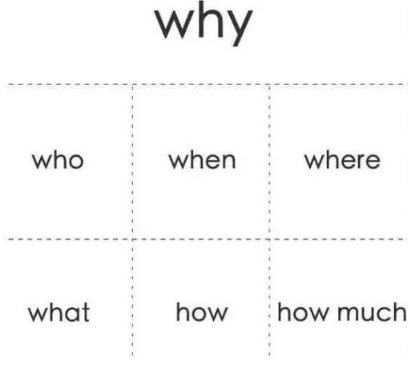

[阿里工程师的自我修养.pdf](https://www.yuque.com/attachments/yuque/0/2020/pdf/690827/1577955161593-80b76041-4974-49dd-9aac-5691decba088.pdf)

---

# 技术人具备“结构化思维”意味着什么？

## 什么是结构化思维
结构化思维的定义就是：**逻辑+套路**。

- **表达要有逻辑**：所谓逻辑是指我们的结构之间必须有逻辑关系。四种组织思想的逻辑关系
   - 因果顺序：大前提，小前提，结论
   - 时间顺序：第一，第二，第三
   - 空间顺序：前端，后端，数据
   - 程度顺序：最重要，次重要，不重要
- **做事要有套路**：解决问题的方法论。5W2H就是一个很好的“套路”：

## 如何进行结构化思考

- **建立中心**：定义清楚要解决的问题，明确目标。建立中心的两种方式：
   - **自上而下**：适用于问题比较明确的情况，只需要找到问题核心展开即可
   - **自下而上**：问题不明确，对多种杂乱内容进行分类归纳为一个中心
- **结构化分解**：确定中心后，构建一个结构，使用结构化的思维对问题进行分解（使用上面的四种逻辑顺序）。
   - MECE准则：Mutually Exclusive Collectively Exhaustive（相互独立，完全穷尽）

## 结构化思维应用

### 融入新团队

### 如何晋升述职

- 罗列事情，不能体现思考深度和带来的价值。更好的表述：

- 仅仅阐述价值，让人觉得有邀功之嫌。比如你说：“我主导研发的风控系统把公司的坏账率从 5% 降低到 2%”。这样的表述是不够的，你还需要把价值背后的过程和思考说清楚。更好的表述
   - 之前为什么那么高？
   - 为什么你的方法可以降低？是如何归因的？
   - 具体解决了什么问题？
   - 是否可以总结出一套办法，以后别人也能用这个办法解决这些问题？

# 优秀工程师必备的三大思维
专人专岗的协作模式的缺点：

- 岗位间有不可避免的一些模糊地带，容易忽视，从而拉低团队效能
- 固化个体的思维和心智，将个体的思维框定在所处岗位内，以至于对岗位外的内容不能很好的理解，使个体缺乏同理心，系统性，**影响工作幸福感**。

## 三大思维图解
工程师思维：**产品，技术，工程**。

## 关键点题

1. 在产品价值创造的道路上，**最害怕的事莫过于只顾低头干做加法，做得多却无人关心收效**。而我们通过数据化闭环的形式，不仅能让整个产品大团队聚焦于核心价值，还能帮助团队在探索用户价值的道路上理性地做减法。大多情形下，**做减法远难于做加法**。
1. 不少工程师这里会有一个误区，忘记了敏捷思想所倡导的“**项目计划的目的是为了适应变化**”，而是将“按时交付”当作是天职，各种赶工爬到终点时却毫不意外地看到了“一地鸡毛”的景象。
1. 在迈向第四次工业革命的道路上，人工智能、大数据、机器学习，Kubernetes、Istio、Knative、Go、Dart、Flutter 等新技术不断冲击着工程师已掌握的技能。**快速跟上技术的迭代步伐是每个有追求的工程师不断提升自己专业素养的表现之一**。
1. 为了让产品的质量做到可靠，**单元测试、静态分析、动态分析等确保工程质量的手段应成为工程师的基本工作内容**，通过将这些手段与 CI（Continuous Integration）流程进行整合去持续构建起对软件产品的质量信心，

# 优秀工程师必备的一项技能
很多程序员在工作一段时间后会遇到迷茫期，虽有技术傍身，也难免会产生焦虑，反复思考怎样才能快速成长。

## 

## 技术成长误区

- 只要把事情搞定了，成长是自然而然的事情——可能过段时间，你发现之前犯过的错误，后来一个都没有避免
- 我只要努力，996 甚至 007，我就能够成长得比别人快——可能你发现你干得最多，但是并没有拿到最好的结果；
- 我尽力了，还是比别人慢，应该是我智商确实差一些——恭喜你，其实大家的智商并不会有太大差别；
- 别人表现好，或者晋升了，只不过是比我表达能力更强而已——我可以负责任地告诉你，这并不是仅仅是表达能力的问题。

## 必备的一项技能：思考力

### 

### 原理性思维：找出知识背后的原理

- 掌握原理实际上可以大幅度降低我们对于知识的记忆量，**知识量是爆炸的，但是原理绝对是可控的！ 
**
- **原理性的东西比直接的知识有更强的复用度**！ 记住最核心的原理，当你面对新的场景时，你会惊喜地发现，你的理解速度大大加快！
- **探求原理的过程，本身很有乐趣**！ 这是一个非常有价值的思维训练过程。一段时间训练以后，你会发现你看透本质的能力越来越强！

### 结构化思维：构建自己的知识树
面对任何一个场景，不管多大多小，我们所需要掌握的知识或者技能都可以构建成一个树结构，同类之间是顺序关系，上下之间是父子关系（或者粗细颗粒度）。

如何训练出自己的知识树：

- **总结自己的知识树，不要盲从书本上或者别人的：**如果没有内化别人的知识成为自己的知识，这棵树不太能够很熟练地运用；
- **习惯性总结：**做完任何一个事情，都习惯性地回顾一下，往自己的树上面挂新东西
- **推荐xmind工具，构建树**
- **训练自己的思维习惯和做事方式变得结构化**

### 扩展性思维：举一反三，扩展思维
扩展性思维的核心目标是提升我们思维的广度， 也就是让我们的知识树变得更加开阔；

### 抓重点思维：提升效率，方便记忆和传递
筛选重点的思路：

- **归纳法**：细节隐藏掉，呈现知识的脉络，这是一种非常好的思路； 尤其是大家在准备晋升 ppt时，**ppt的每一页都需要归纳一个核心观点，不是全是细节，这个非常重要！**
- **优先级法**：比如完成一个事情可能有若干个步骤，其中哪个步骤是最有效的，大致可以做一个排序。在实施的时候，你可以按照优先级去落实。

### 反思性思维：思考哪里可以做得更好
反思性思维的实践，注意有两个点比较关键：

1. 反思性思维最重要的意识：做事情的过程总有优化的空间，每次都要有进步；如果没有这种心态，那么很难持续地进行反思；
1. 反思是一种习惯和潜意识，可以在不经意之间经常进行， 其实不需要很形式化地花很多时间，有时候做完一个事情，习惯性思考一下就可以。

## 提升思考力

- 思考力提升最关键的是意识的转变；
- 要对思考力的提升充满信心；
- 多在工作中去锻炼思考力，不需要花太多额外的休息时间；
- 多相互分享；
- 团队 Leader 要团队同学的成长和把思考力提升作为最重要的内容，并拿出实际行动。

# 如何在工作中快速成长

## 思考脑和反射脑

## 习以为常

## 时间管理

学习必须是每日的必修课，必须是日拱一卒，持之以恒，有不断的输入，也有不断的输出，持续地沉淀，在关键时刻输出解决问题能力，从而获得能力认可。

## 注意力
给自己准备一个笔记本或 Evernote，边读边思考，顺带把重要的观点记录下来，开始会觉得很困难，但是慢慢坚持下来你会发现，思考会越来越深入，注意力集中时间越来越长。

## 向贵人求助
把求助看成一种交易，一种有着“巨大意义”的交易，**你求助时，别人之所以愿意帮助你，是因为他已经看到你的价值**，这种价值帮助他确定了自己的价值（他有能力帮助你），或者未来你可以帮助他。

## 跳出舒适区
为什么感觉看了那么多的书，工作了那么多年，写了那么多代码，自己在一开始的进步明显后，到现在基本停止进步？我想是因为在舒适区呆的太久了，看再多的书，写再多的代码，可能**只是以一种舒适的方式进行工作和生活而已**。

## 职业规划
**职业规划不是某个岗位，某个角色，而是工作能力的提升**。针对自己岗位需要的能力，职场需要的能力，然后用专家思维，多维视角重点突破 3-4 项能力，抱着 120% 的努力拿到结果，甚至是超出期望的结果，事情成了，能力也就被认可了，所谓的角色，岗位只是顺其自然的结果。

# 

# 关于技术规划、管理、架构的思考

# 程序员如何自我学习

- 行业发展得太快，你必须学习， 纯靠经验积累行不通，**技术淘汰的速度远大于你经验积累的速度**。
- 只要 2-3 年不关注技术，就基本快和程序员和编程绝缘啦，不是绝对，但是通常不会错。
- 在排查问题和写代码上，如果你 1 个小时只能尝试一种方法，别人却能够尝试 10 次，那么别人就是比你牛。天下武功唯快不破，你后续写 demo、查问题、**工具的熟练程度都会决定你学习和尝试新事物的速度**。
- 看源码是非常重要的一个技能。至少你 code review 技能提升，但成本确实高。
- 项目中多尝试一下你学到的新知识，**不能惯性使用你熟悉的技术**，要知道你熟悉的东西很快会被淘汰，被淘汰后再调整就来不及了。
- 新闻都是帮助你找找聊天话题，做为饭后谈资，没有什么大用，反而浪费你不少时间，你可能半个小时都在刷新闻，而且现在新闻都有智能算法，保证能黏住你。
- 一个人走得快，一群人走得远
- 困境是个人成长的最好机会，放弃、逃避、拒绝思考，就意味着放弃成长。

# 技术主管有话想说

- 把责任都扛在自己身上，亲自去协调每项工作，让团队成员没有后顾之忧，让团队同学相信我可以搞定他们担心的事情，出了任何问题我可以来背锅，**给自己的团队创造一个相对宽松和自由的工作空间**，保护团队不被外部的各种杂事伤害到。
- 人往往会高估自己而低估别人，**很多管理者都会觉得手下交上来的工作做得不够完美，这里考虑不周那里做的啰嗦**，但很多时候你只是看到了他人不擅长的地方，或者只是对方和你的出发点不同给出了不同的解决方案而已。
- 很多时候，我们并不如自己想象的那么强。
- **集权式管理**：管理者的风格是偏细节的，定义清晰的工作目标，并且把工作目标分解得非常细致，让手下的团队能按照整个计划步步为营往前推进，这是一种风格，相对来讲比较集权。
- **放权式管理**：定义大的目标，把握大的方向，做关键性的决策。但是并不深入每个细节去管控手下团队的执行细节，以结果为导向。
- 团队文化：
   1. 坦诚，公开，透明；
   1. 平等相处，消除等级感；
   1. 工作气氛轻松，团队关系和谐；
   1. 敢于担当，主动承担责任；
   1. 成就他人，乐于分享
- **作为技术 TL 最成功的是招到比你更优秀的人**，你不需要担心自己会不会被取代，一是成就个人和成就团队，作为 TL 应该抱着如何成就团队的发展思路，**不能让自己成为天花板**，本身技术就不应该是你最擅长的事情！
- 人能够成长为智者和大师要先从愚昧之巅，掉到绝望之谷，然后辛苦攀爬，积累知识和经验，成为智者和大师。

